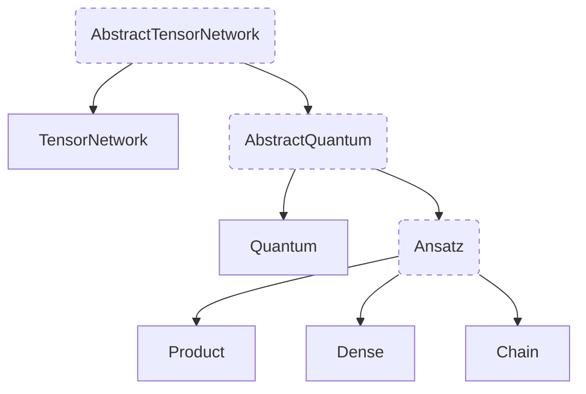

# Inheritance and Traits

Julia (and in general, all modern languages like Rust or Go) implement Object Oriented Programming (OOP) in a rather restricted form compared to popular OOP languages like Java, C++ or Python.
In particular, they forbid _structural inheritance_; i.e. inheriting fields from parent superclass(es).

In recent years, _structural inheritance_ has increasingly been considered a bad practice, favouring _composition_ instead.

Julia design space on this topic is not completely clear. Julia has _abstract types_, which can be "inherited" but do not have fields and can't be instantiated, and _concrete types_, which cannot be inherited from them but have fields and can be instantiated. In this sense, implementing methods with Julia's abstract types act as some kind of polymorphic base class.

As of the time of writing, the type hierarchy of Tenet looks like this:

