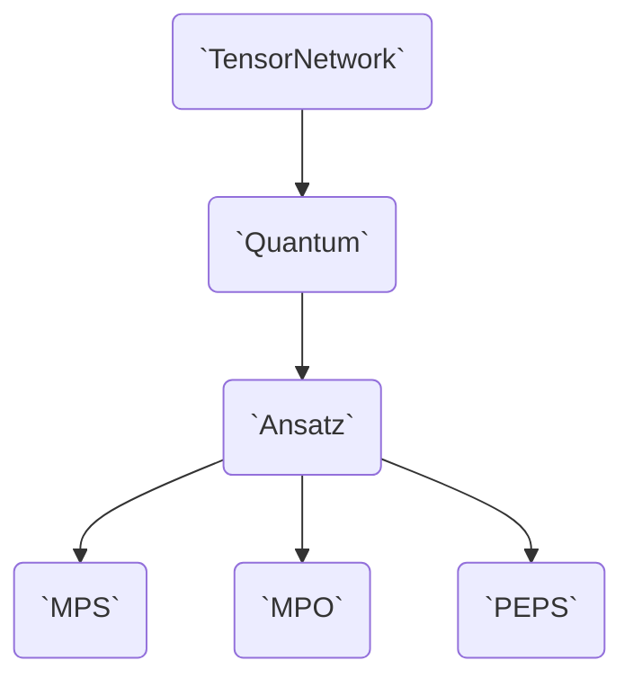

# The Design of Tenet

Tenet.jl aims to be...

- Fast
- Intuitive
- Flexible

....

In order to be fast, Tenet.jl tries minimizing memory allocations, 

In order to be intuitive, ...

In order to be flexible, Tenet.jl divides functionalities into a type hierarchy, interface and trait system so that the user can 

```mermaid
graph TD
    tn(Tensor Network (TN))
    ansatz(Tensor Network with fixed structured)
    quantum(Tensor Network pluggable)
    ansatz_quantum(Both)
    tn --> ansatz --> ansatz_quantum
    tn --> quantum --> ansatz_quantum
```


