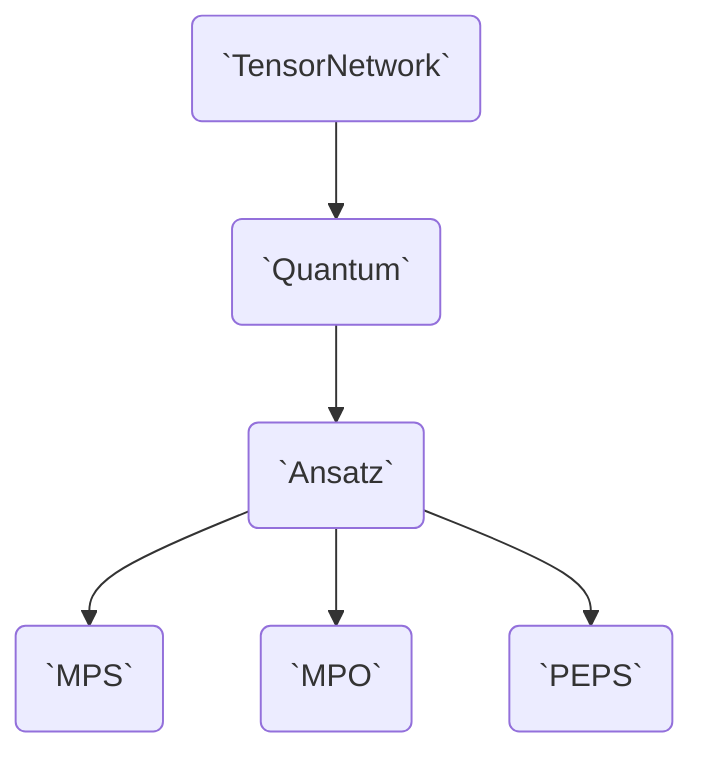

# The Design of Tenet

Tenet.jl is a Tensor Networks library that aims to be

- Fast
- Intuitive
- Flexible

In order to be fast, Tenet.jl tries minimizing memory allocations. It's deep integration with [Reactant.jl](https://github.com/EnzymeAD/Reactant.jl) allows.

!!! todo
    We are in the process of making [`contract`](@ref) multi-backend; i.e. let the user choose between different einsum libraries as the engine powering [`contract`](@ref). Currently, we just use [OMEinsum.jl](@ref), but it has proven to be slow in the way we use it. Other ...

In order to be intuitive, ...

In order to be flexible, Tenet.jl divides functionalities into a type hierarchy, interface and trait system so that the user can each level is in charge of just one specific aspect.

In its most general definition, a Tensor Network is a hyper-, multi-, open-graph whose vertices map to tensors and edges map to tensor indices.

- It's an hypergraph because an index can appear in more than two tensors.
- It's a multigraph because two tensors can have more than one index in common.
- It's a opengraph because there are open indices.

The layer ...

If the Tensor Network models vector-like and operator-like objects, in such a way that connecting them would be similar to a matrix-vector product, then we are talking about a [`Quantum`](@ref).
equivalent
If the Tensor Network has a fixed graph topology, then we are talking about a [`Ansatz`](@ref).

The reason for this disambiguation is that there are pluggable TNs without a fixed topology (e.g. quantum circuits) and TNs with fixed structure that are not connectable (e.g. partition functions expressed as TNs usually have grid-like structure without open indices).
Of course, there are ...
We want Tenet.jl to be capable of expressing any posible TN

In a Object-Oriented Programming (OOP) language with multiple-inheritance like C++, Java or Python, you could envision these classes with the following inheritance diagram.

```mermaid
graph TD
    tn(Tensor Network (TN))
    ansatz(Tensor Network with fixed structured)
    quantum(Tensor Network pluggable)
    ansatz_quantum(Both)
    mps(MPS)
    mpo(MPO)
    peps(PEPS)
    tn --> ansatz --> ansatz_quantum
    tn --> quantum --> ansatz_quantum
    ansatz_quantum --> mps
    ansatz_quantum --> mpo
    ansatz_quantum --> peps
```

But since Julia only allows single-inheritance, 

!!! note
    In reality, this diagram is more complicated because Julia doesn't allow inheritance of concrete classes, only of abstract classes.
    Due to this, we have a duplication of types for the abstract and concrete types (e.g. `TensorNetwork` and `AbstractTensorNetwork`).
    You can check the full diagram in [Inheritance and Traits](@ref).

!!! todo
    We are planning to ditch abstract inheritance and move to a trait system, which is more verbose but fixes a lot of abstraction problems like this "serializaton of the classes". Thus, this diagram might not be valid anymore in future releases.


