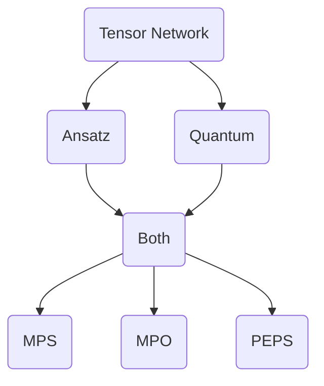
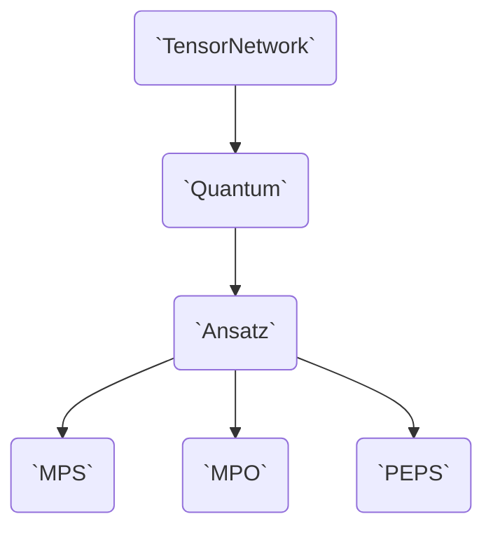

# The Design of Tenet

Tenet.jl is a Tensor Networks library that aims to be:

- Flexible
- Ergonomic
- Fast

In order to be flexible, Tenet.jl splits functionalities into types and traits.
Composing all layers results into a fully working Tensor Network and at the same time, it lets the user customize the internals with a public interface.

In order to be ergonomic, we try to be as idiomatic as posible to Julia.

In order to be fast, Tenet.jl tries to minimize memory allocations and to select the best algorithmic method for the target Tensor Network.

Optimizing for these goals is a constant pursue, but Tenet.jl's direction is set to improve these.

## How Tenet.jl sees Tensor Networks

Tensor Networks are a graphical notation of einsum (i.e. Einstein's summation notation) expressions, in which vertices represent tensors and edges represent tensor indices.
For example, the following equation...

```math
\sum_{ijklmnop} A_{im} B_{ijp} C_{njk} D_{pkl} E_{mno} F_{ol}
```

...can be represented visually as

```@raw html


```

This notation is specially handy when the number of tensors grows.

If we don't stick to the strict rules of einsum[^1] and take a broader definition, a Tensor Network is represented by a hyper-, multi-, open-graph.

[^1]: On Einstein's summation notation, an index can only appear twice: either in two contracting tensors or in one contracting tensor and the resulting tensor.

- It's an hypergraph because an index can appear in more than two tensors.
- It's a multigraph because two tensors can share more than one index.
- It's an opengraph because there are open indices (i.e. the physical indices of states and operators).

In Tenet, the `TensorNetwork` class is in charge of such general represention.
A [`TensorNetwork`](@ref) is an (hyper-,multi-,open-)graph of [`Tensor`](@ref)s. No more, no less.

But Tensor Networks are commonly used to represent more concrete objects, and the more we concretize, the more information we need to add.
Each new functionality or concretization is managed by a new class, with [`TensorNetwork`](@ref) being the most abstract.

## How Tenet.jl sees Quantum Tensor Networks

Indeed, Quantum Tensor Networks require two different concretizations.

On one hand, Tensor Networks can model vector-like and operator-like objects, in such a way that connecting and contracting them is similar to a matrix-vector product.
This requires a kind of plug in system in which open edges know how to connect with another Tensor Network's open edges.
In Tenet, the class in charge of representing Tensor Networks with external connection information is [`Quantum`](@ref).

On the other hand, the graph topology of a Tensor Network dictaminates both its representation capabilities and computational complexity.
Tensor Networks frequently map to the underlying lattice structure of the quantum system they are simulating.
The class in charge of representing Tensor Networks with a fixed graph structure is [`Ansatz`](@ref).

The reason for this disambiguation is that there are pluggable Tensor Networks without a fixed topology (e.g. quantum circuits) and Tensor Networks with fixed structure that are not connectable (e.g. partition functions expressed as Tensor Networks usually have grid-like structure without open indices).
Of course, a major use of Tensor Networks involves using both capabilities (e.g. MPS/PEPS/... are both pluggable and have a fixed structure), but we wanted Tenet.jl to be capable of expressing any posible Tensor Network

In a Object-Oriented Programming (OOP) language with multiple-inheritance like C++, Java or Python, you could envision these classes with the following inheritance diagram.



But since (1) Julia only allows single-inheritance, and (2) inheritance by composition only allows tree-like inheritance diagrams, the type hierarchy is serialized as follows.

!!! note
    In reality, this diagram is more complicated because Julia doesn't allow inheritance of concrete classes, only of abstract classes.
    Due to this, we have a duplication of types for the abstract and concrete types (e.g. `TensorNetwork` and `AbstractTensorNetwork`).
    You can check the full diagram in [Inheritance and Traits](@ref).

!!! todo
    We are planning to rely less on abstract inheritance and move to a trait system, which is more verbose but gives backs the control of the type hierarchy to us. Thus, this diagram might not be valid anymore in future releases. However, the public API of the [`TensorNetwork`](@ref), [`MPS`](@ref), [`MPO`](@ref)... are mostly stable and only changes on [`Quantum`](@ref) and [`Ansatz`](@ref) are to be expected.



In the following sections, you will find a more detailed explanation of each class: how to construct them, how to compose them and what kind of operations can you perform on them.
