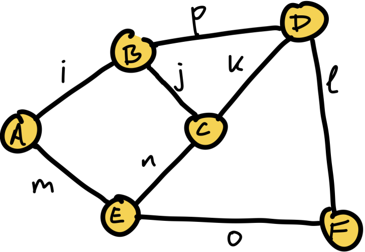

# Tensor Networks

Tensor Networks (TN) are a graphical notation for representing complex multi-linear functions. For example, the following equation

```math
\sum_{ijklmnop} A_{im} B_{ijp} C_{njk} D_{pkl} E_{mno} F_{ol}
```

can be represented visually as

```@raw html
<figure>

<figcaption>Sketch of a Tensor Network</figcaption>
</figure>
```

The graph's nodes represent tensors and edges represent tensor indices.

In `Tenet`, these objects are represented by the [`TensorNetwork`](@ref) type.

```@docs
TensorNetwork
```

Information about a `TensorNetwork` can be queried with the following functions.

## Query information

```@docs
inds(::Tenet.AbstractTensorNetwork)
size(::Tenet.AbstractTensorNetwork)
tensors(::Tenet.AbstractTensorNetwork)
```

## Modification

### Add/Remove tensors

```@docs
push!(::Tenet.AbstractTensorNetwork, ::Tensor)
append!(::Tenet.AbstractTensorNetwork, ::Base.AbstractVecOrTuple{<:Tensor})
merge!(::Tenet.AbstractTensorNetwork, ::Tenet.AbstractTensorNetwork)
pop!(::Tenet.AbstractTensorNetwork, ::Tensor)
delete!(::Tenet.AbstractTensorNetwork, ::Any)
```

### Replace existing elements

```@docs
replace!
```

## Selection

```@docs
select
selectdim
slice!
view(::Tenet.AbstractTensorNetwork)
```

## Miscelaneous

```@docs
Base.copy(::Tenet.AbstractTensorNetwork)
Base.rand(::Type{TensorNetwork}, n::Integer, regularity::Integer)
```
