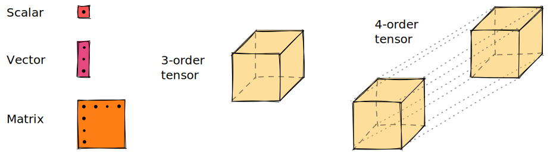

# Tensors

```@setup tensor
using Tenet
```

There are many jokes[^1] about how to define a _tensor_. The definition we are giving here might not be the most correct one, but it is good enough for our use case (don't kill me please, mathematicians).
A tensor $T$ of order[^2] $n$ is a multilinear[^3] application between $n$ vector spaces over a field $\mathcal{F}$.

[^1]: For example, recursive definitions like _a tensor is whatever that transforms as a tensor_.
[^2]: The _order_ of a tensor may also be known as _rank_ or _dimensionality_ in other fields. However, these can be missleading, since it has nothing to do with the _rank_ of linear algebra nor with the _dimensionality_ of a vector space. We prefer to use word _order_.
[^3]: Meaning that the relationships between the output and the inputs, and the inputs between them, are linear.

```math
T : \mathcal{F}^{\dim(1)} \times \dots \times \mathcal{F}^{\dim(n)} \mapsto \mathcal{F}
```

In layman's terms, it is a linear function whose inputs are vectors and the output is a scalar number.

```math
T(\mathbf{v}^{(1)}, \dots, \mathbf{v}^{(n)}) = c \in \mathcal{F} \qquad\qquad \forall i, \mathbf{v}^{(i)} \in \mathcal{F}^{\dim(i)}
```

Tensor algebra is a higher-order generalization of linear algebra, where scalar numbers can be viewed as _order-0 tensors_, vectors as _order-1 tensors_, matrices as _order-2 tensors_, ...

```@raw html

```

Letters are used to identify each of the vector spaces the tensor relates to.
In computer science, you would intuitively think of tensors as "_n-dimensional arrays with named dimensions_".

```math
T_{ijk} \iff \mathtt{T[i,j,k]}
```

## The `Tensor` type

In `Tenet`, a tensor is represented by the `Tensor` type, which wraps an array and a list of symbols. As it subtypes `AbstractArray`, many array operations can be dispatched to it.

You can create a `Tensor` by passing an array and a list of `Symbol`s that name indices.

```@repl tensor
Tᵢⱼₖ = Tensor(rand(3,5,2), (:i,:j,:k))
```

The _dimensionality_ or size of each index can be consulted using the `size` function.

```@docs
Base.size(::Tensor)
```

```@repl tensor
size(Tᵢⱼₖ)
size(Tᵢⱼₖ, :j)
length(Tᵢⱼₖ)
```

## Operations

### Contraction

```@docs
Tenet.contract(::Tensor, ::Tensor)
```
